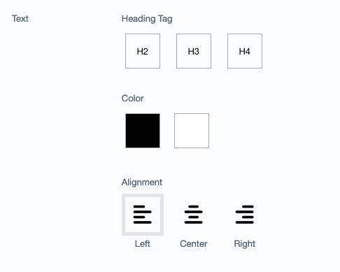

# Silverstripe Layout Options Module
[](https://github.com/mkenney/software-guides/blob/master/STABILITY-BADGES.md#beta)

This module provides extensions for layout options. The options can be attached to pages, elements or each data object. By default this module comes with options for text, background and width. Furthermore, this package contains a selection field wich is based on [color palate field by heyday](https://github.com/heyday/silverstripe-colorpalette).

* [Requirements](#requirements)
* [Installation](#installation)
* [Configuration](#configuration)
* [Default Layout Options](#default-layout-options)
* [Update Options](#update-options)
* [Reporting Issues](#reporting-issues)

## Requirements

* Silverstripe CMS ^4.0 || ^5.0
* Silverstripe Framework ^4.0 || ^5.0
* [Silverstripe Color Palette Field ^2.1](https://github.com/heyday/silverstripe-colorpalette)
* [Silverstripe Selection Field ^1.0](https://github.com/pixelpoems/silverstripe-selection-field)

## Installation
```
composer require pixelpoems/silverstripe-layout-options
```

## Configuration
Add the desired extension on Page:
```yml
Page:
  extensions:
    - Pixelpoems\LayoutOptions\Extensions\Text
    - Pixelpoems\LayoutOptions\Extensions\Background
    - Pixelpoems\LayoutOptions\Extensions\Width
    - Pixelpoems\LayoutOptions\Extensions\Image
```

or Element (if you use Elemental form DNADesign e.g.):
```yml
DNADesign\Elemental\Models\BaseElement:
  inline_editable: false
  extensions:
    - Pixelpoems\LayoutOptions\Extensions\Text
    - Pixelpoems\LayoutOptions\Extensions\Background
    - Pixelpoems\LayoutOptions\Extensions\Width
    - Pixelpoems\LayoutOptions\Extensions\Image
```
The fields will appear in the order the extensions are added within the yml config.

Each entity can be hidden if they should not appear e.g.:
```yml
Page:
  hide_layout_option_heading_tag: true
  hide_layout_option_text_color: true
  hide_layout_option_text_align: true
  hide_layout_option_background_color: true
  hide_layout_option_width: true
  hide_layout_option_image_orientation: true
  hide_layout_option_image_brightness: true
  hide_layout_option_image_shape: true
```

## Default Layout Options
### Text


### Background


### Width


### Image


## Update Options
For each option set, you can use a hook to update/expand the options from which the user can choose.
```yml
Pixelpoems\LayoutOptions\Services\LayoutService:
  extensions:
    - Namespace\YourLayoutServiceExtension
```

To configure the options for the heading tag, text color, text align, background color and width, you can add config variables like this:
```yml
Pixelpoems\LayoutOptions\Services\LayoutService:
  heading_tag_options:
    h2:
      Value: 'h2'
      Title: 'H2'
  text_color_options:
    white: '#fff'
    black: '#000'
  align_options:
    left:
      Value: 'left'
      Title: 'Left'
      ShowTitle: true
      Icon: 'align-left'
  layout_width_options:
    small:
      Value: 'small'
      Title: 'Small'
      ShowTitle: true
      Content: 'S'
  background_color_options:
    white: '#fff'
    black: '#000'
```
The options, which are configured in the yml file, will overwrite the default options!


Otherwise, you can use the following hooks to update the options or add new ones:

```php
public function updateHeadingTagOptions(&$options)
{
    // Add an option
    $options['h5'] = [
        'Value' => 'h5',
        'Title' => 'H5',
    ];
}

public function updateTextColorOptions(&$options)
{
    // Add an option
    $options['text-light'] = '#ffcdb2';
}

public function updateAlignOptions(&$options)
{
    // Add an option
    $options['justify'] = [
        'Value' => 'justify',
        'Title' => 'Justify',
        'ShowTitle' => true,
        'Icon' => 'align-justify'
    ];
}

public function updateLayoutWidthOptions(&$options)
{
    // Add options
    $options = array_merge($options, [
        'xs' => [
            'Value' => 'xs',
            'Title' => 'XS',
            'ShowTitle' => true,
        ],
        'xl' => [
            'Value' => 'xl',
            'Title' => 'XL',
            'ShowTitle' => true,
        ]
    ];
}

public function updateBackgroundColorOptions(&$options)
{
    // Overwrite the default Background Colors
    $options = [
        'white' => '#ffffff',
        'bg-1' => '#ffcdb2',
        'bg-2' => '#ffb4a2',
        'bg-3' => '#e5989b',
        'bg-4' => '#b5838d',
        'bg-5' => '#6d6875',
        'black' => '#000000',
    ];
}
```

## Holder Classes
This module comes also with an extension of the DNADesign Elemental Base Element.
This extension adds holder classes to the element. The holder classes are a combination of the layout options and a `el-classname` class. This holder class can be used to style the element in the frontend. The holder class is added to the holder div of the element.

If you want to manipulate or add your custom layout classes to this holder class, you can use the following hook:
```php
// Extension of DNADesign\Elemental\Models\BaseElement
public function updateHolderClasses(&$classes)
{
    // Add a class
    $classes[] = 'my-custom-class';

    // Add a class based on the layout options
    $element = $this->owner;
    if($element->NewLayoutOption && !$element->config()->get('hide_layout_option_new_layout_option'))) $holderClasses[] = 'abc--' . $element->NewLayoutOption;

}
```
## Reporting Issues
Please [create an issue](https://github.com/pixelpoems/silverstripe-layout-options/issues) for any bugs you've found, or
features you're missing.
